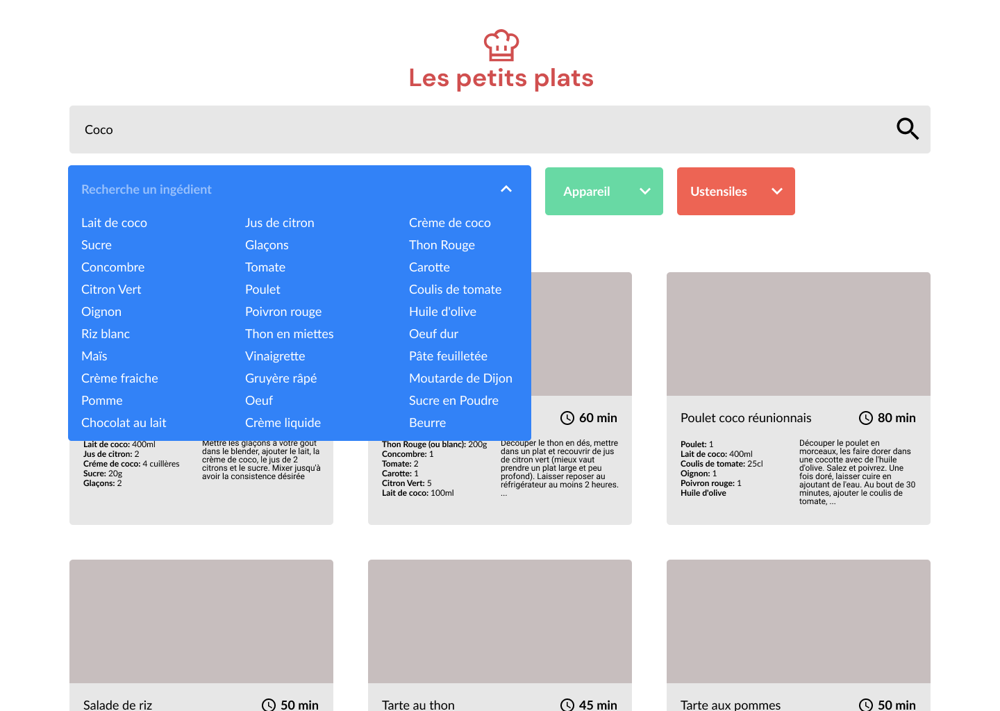
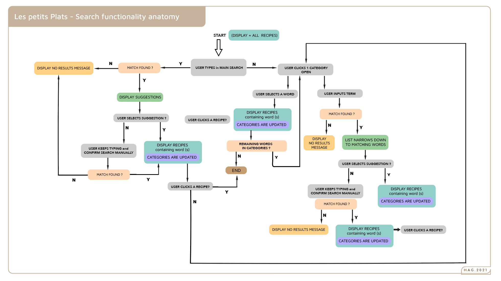

## LES PETITS PLATS: search engine for recipes
---
#### deploy using trie search => https://githubagneska.github.io/js-prefix-tree-search/
#### deploy using linear search => https://githubagneska.github.io/linear-search/
---

<p align="center">
    
</p>

---
### Stack
- Vanilla Javascript
- Webpack
- Sass

---
### Install
```bash
$ git clone https://github.com/GitHubAgneska/HAgnesGenay_7_19112020.git
$ npm install
$ npm run start
```
---
### Project purpose
- Build a search engine with 2 versions of a search algorithm
- Compare performances for each algorithm

<p align="center">
    
</p>

----


